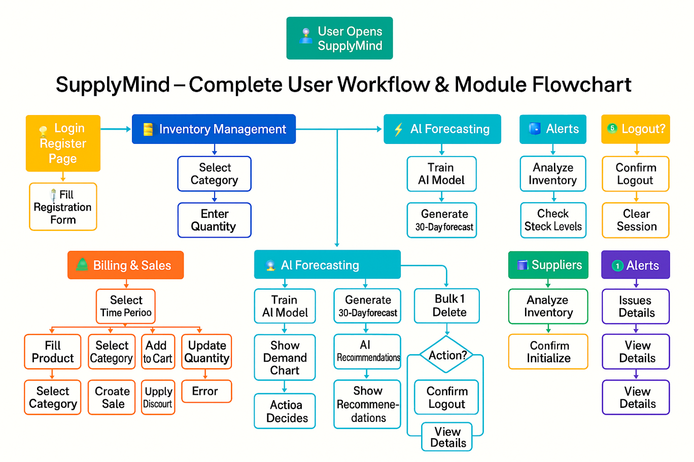
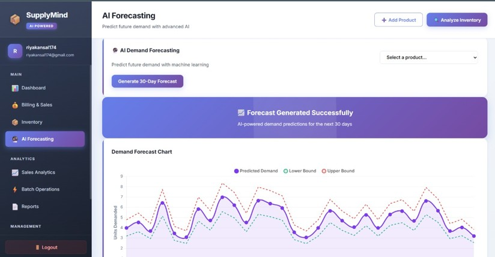
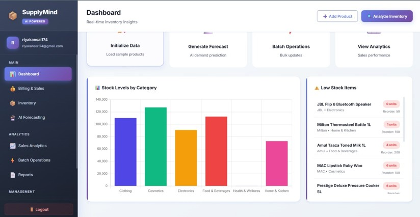
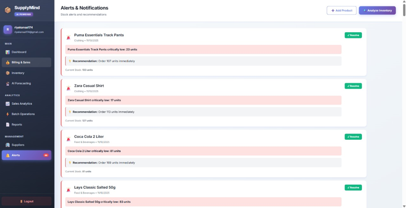
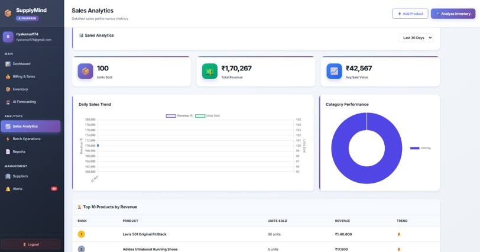
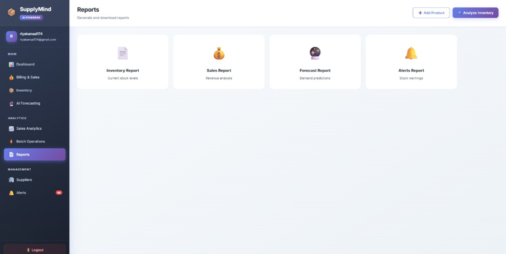

# 📦 SupplyMind  
**An AI-Driven Retail Inventory Forecasting & Alert Management System**

SupplyMind is an **end-to-end AI-powered retail intelligence system** that automates invoice processing, predicts product demand using deep learning, and generates real-time inventory alerts to support smarter retail decision-making.

---

## 🚀 What This Project Does

SupplyMind helps retailers:
- ❌ Eliminate manual invoice entry  
- 📉 Reduce stockouts and overstocking  
- 📊 Improve demand forecasting accuracy  
- ⚡ Receive real-time inventory alerts  

By combining **OCR automation**, **deep learning forecasting**, and **interactive dashboards**, the system delivers a complete inventory management workflow.

---

## 🧠 Framework Overview

SupplyMind follows a **modular AI pipeline**:

1. 📄 **Invoice Data Extraction**  
   OCR converts invoice images into structured digital records.

2. 🧹 **Data Preprocessing**  
   Cleans, normalizes, and structures multi-category time-series data.

3. 📈 **Demand Forecasting**  
   Deep learning predicts daily and weekly product demand.

4. 🚨 **Alert Generation**  
   Detects stockout risks, overstock conditions, and demand spikes.

5. 🖥️ **Dashboard & APIs**  
   Real-time visualization with backend integration via REST APIs.

---

## 🗂️ Dataset Used

- 🧾 Retail sales & inventory data extracted from invoices  
- 🛒 Multi-category time-series records  
- 🧠 Preprocessed to handle missing values, noise, and irregular intervals  

---

## ⚙️ Models & Methods (High-Level)

- 🧠 **Forecasting Model:** N-BEATS (Neural Basis Expansion Analysis for Time Series)  
- 🔍 **OCR:** Tesseract OCR + OpenCV image preprocessing  
- 🧩 **Backend:** Flask APIs with SQLite database  
- 🎨 **Frontend:** HTML, CSS, JavaScript, Tailwind CSS  
- 📊 **Visualization:** Chart.js  
- 🧪 **Data Processing:** Python, Pandas, NumPy  

---

## 📊 Results

## 📊 Results

### 🔄 System Flowchart  
Overall workflow and user interaction flow of the SupplyMind system.

---

### 📈 AI Forecasting Output  
Accurate demand forecasts generated for multiple product categories.

---

### 🖥️ Inventory Dashboard  
Interactive dashboard displaying inventory health, forecasts, and alerts.

---

### 🚨 Alerts & Notifications  
Automatic detection of stockout risks, overstock conditions, and unusual demand patterns.

---

### 📊 Sales Analytics  
Visual analysis of sales trends and demand patterns.

---

### 🗂️ Reports Module  
Automatically generated inventory and forecasting reports.

---

### ⚙️ Batch Operations  
Batch-level processing for inventory updates and forecasting runs.

---

## ▶️ How to Run (Optional)

1. 📥 Clone the repository  
2. 📦 Install required Python dependencies  
3. 🚀 Run the Flask backend  
4. 🌐 Access the dashboard via browser  

*(Exact setup may vary based on environment.)*

---

## 👩‍💻 Author

**Riya Kansal**  
🎓 B.Tech Computer Science & Engineering  
🏫 Amity School of Engineering & Technology  

---

✨ *SupplyMind demonstrates how AI-driven automation can transform retail inventory management through intelligent forecasting and real-time decision support.*

